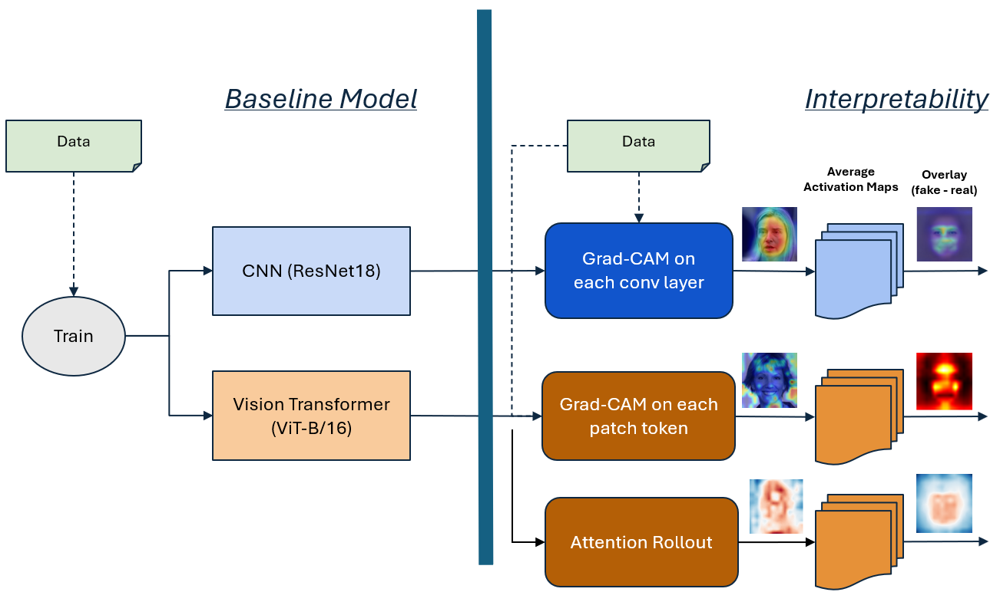

# Deep Learning AI vs Fake Faces

Deepfake detection and interpretability project comparing **ResNet-18** and **Vision Transformer (ViT-B/16)** models for classifying face images as real or AI-generated.

This project goes beyond basic real-vs-fake classification. It evaluates how different deep learning architectures behave across multiple fake-face categories, including **GAN-generated faces**, **diffusion-generated faces**, and **face-swap images**, then uses **Grad-CAM** and **attention rollout** to interpret what each model focuses on when making predictions.

## Methodology Overview

The project compares a baseline deepfake classification pipeline with an added interpretability layer. The baseline trains two image classification models, **ResNet-18** and **ViT-B/16**, to classify face images as real or fake. The added analysis applies interpretability methods to understand what each model focuses on across different fake-image categories.



The baseline model focuses on classification performance, while the extended pipeline adds visual explanation methods:

- **Grad-CAM** for ResNet convolutional layers
- **Grad-CAM-style patch analysis** for ViT patch tokens
- **Attention rollout** for transformer attention maps
- Category-level comparison across GAN, diffusion, and face-swap images

## Mathematical Formulation

The task is modeled as a binary classification problem. Given an input face image $x_i$, the model predicts whether the image is real or fake:

$$
y_i \in \{0, 1\}
$$

where:

$$
0 = \text{real face}, \qquad 1 = \text{fake / AI-generated face}
$$

The model produces logits:

$$
z = f_\theta(x)
$$

These logits are converted into class probabilities using the softmax function:

$$
p(y=c \mid x) = \frac{e^{z_c}}{\sum_{j=1}^{C} e^{z_j}}
$$

The models are trained using cross-entropy loss:

$$
\mathcal{L} = -\frac{1}{N}\sum_{i=1}^{N}\sum_{c=1}^{C} y_{i,c}\log(\hat{y}_{i,c})
$$

where $N$ is the number of samples, $C$ is the number of classes, $y_{i,c}$ is the true label, and $\hat{y}_{i,c}$ is the predicted probability.

## Grad-CAM Formulation

For the ResNet model, Grad-CAM highlights the image regions that most strongly influence the prediction. For a target class $c$, the importance weight for feature map $A^k$ is computed as:

$$
\alpha_k^c = \frac{1}{Z}\sum_i\sum_j \frac{\partial y^c}{\partial A_{ij}^k}
$$

The final Grad-CAM heatmap is:

$$
L_{\text{Grad-CAM}}^c = \text{ReLU}\left(\sum_k \alpha_k^c A^k\right)
$$

This produces a class-specific heatmap showing which spatial regions contributed most to the model's decision.

## Attention Rollout Formulation

For the Vision Transformer, attention rollout is used to estimate how information flows from image patches to the final classification token.

Each transformer layer produces an attention matrix $A_l$. To account for residual connections, the attention matrix is adjusted as:

$$
\tilde{A}_l = \frac{A_l + I}{2}
$$

The final rollout map is computed by multiplying attention matrices across all layers:

$$
R = \tilde{A}_1 \tilde{A}_2 \cdots \tilde{A}_L
$$

where $L$ is the number of transformer layers. The resulting map estimates how strongly each image patch contributes to the final prediction.

## Evaluation Metrics

Accuracy:

$$
\text{Accuracy} = \frac{TP + TN}{TP + TN + FP + FN}
$$

Precision:

$$
\text{Precision} = \frac{TP}{TP + FP}
$$

Recall:

$$
\text{Recall} = \frac{TP}{TP + FN}
$$

F1-score:

$$
F_1 = 2 \cdot \frac{\text{Precision} \cdot \text{Recall}}{\text{Precision} + \text{Recall}}
$$

## Main Goals

- Train deep learning models to classify face images as real or AI-generated.
- Compare CNN-based and transformer-based architectures.
- Evaluate detection behavior across fake categories:
  - GAN-generated faces
  - Diffusion-generated faces
  - Face-swap images
- Use interpretability methods to visualize model decision-making.
- Compare **Grad-CAM** explanations from ResNet with **attention rollout** explanations from ViT.
- Analyze whether models focus on meaningful facial regions or irrelevant artifacts.

## Key Features

- Real vs AI-generated face classification
- ResNet-18 model training and evaluation
- Vision Transformer model training and evaluation
- Category-level fake-face analysis
- Grad-CAM visualizations for ResNet
- Attention rollout visualizations for ViT
- ROC curve generation
- Confusion matrix analysis
- Training history visualization
- Data preprocessing and dataset reorganization
- Comparison across GAN, diffusion, and face-swap fake images

## Tech Stack

- Python
- PyTorch
- Torchvision
- NumPy
- Matplotlib
- Seaborn
- Scikit-learn
- OpenCV
- Pillow
- tqdm
- Jupyter Notebook

## Dataset

The project uses a real-vs-AI-generated face dataset from Kaggle and reorganizes it into a cleaner structure for training, testing, validation, and interpretability analysis.

The original dataset contains both real and fake face images from multiple sources. The project separates the fake images into meaningful categories so that model behavior can be analyzed more deeply.

## Dataset Organization

The processed dataset is organized into two main parts:

```text
data/
│
├── dataset/
│   ├── train/
│   │   ├── 0/
│   │   └── 1/
│   │
│   ├── test/
│   │   ├── 0/
│   │   └── 1/
│   │
│   └── validate/
│       ├── 0/
│       └── 1/
│
└── source/
    ├── real/
    │   └── ffhq/
    │
    └── fake/
        ├── GAN/
        ├── Diffusion/
        └── FaceSwap/
```

The `dataset/` folder is used for model training, validation, and testing.

The `source/` folder is used for interpretability analysis by separating images into real and fake-generation categories.

## Fake Image Categories

The fake images are grouped into three major categories:

### GAN

GAN-generated faces include images from sources such as `thispersondoesnotexist` and SFHQ-style synthetic face datasets. These images are typically produced using generative adversarial networks such as StyleGAN-style models.

### Diffusion

Diffusion-generated faces include images created using diffusion-based image generation methods, such as Stable Diffusion.

### FaceSwap

Face-swap images represent manipulated or deepfake-style faces where facial identity has been altered or transferred.

This category-level separation allows the project to analyze not only whether a model detects fake images, but also whether it detects different kinds of fake images in different ways.

## Model Architectures

## ResNet-18

ResNet-18 is used as the CNN-based deepfake detector. It is initialized using Torchvision and modified for binary classification.

The final classification layer is replaced with a two-class output layer:

```text
Class 0 → Real face
Class 1 → AI-generated / fake face
```

ResNet is useful for detecting local image artifacts, texture inconsistencies, and region-specific visual patterns.

The ResNet pipeline includes:

- Image preprocessing
- Transfer learning with pretrained weights
- Binary classification training
- Validation and testing
- Confusion matrix generation
- ROC curve generation
- Grad-CAM interpretability analysis

## Vision Transformer

The Vision Transformer model is used as the transformer-based detector. It divides each image into patches and applies self-attention across those patches.

The project uses a ViT-B/16 style architecture from Torchvision and modifies the classification head for binary classification.

The ViT pipeline includes:

- Image preprocessing
- Patch-based transformer feature extraction
- Binary classification training
- Validation and testing
- Confusion matrix generation
- ROC curve generation
- Attention rollout interpretability analysis

## Interpretability

A major focus of this project is interpretability. Accuracy alone does not explain whether a model is learning meaningful features or relying on irrelevant visual noise.

This project uses two interpretability methods:

## Grad-CAM

Grad-CAM is used to interpret the ResNet model. It highlights the image regions that most strongly influence the CNN's prediction.

Grad-CAM helps answer questions such as:

- Is the model focusing on the face?
- Does the model pay attention to eyes, skin texture, mouth, or background?
- Are the highlighted regions meaningful for deepfake detection?
- Do the highlighted regions change between GAN, diffusion, and face-swap images?

The ResNet Grad-CAM outputs are saved in:

```text
resnet_gradcam_outputs/
```

## Attention Rollout

Attention rollout is used to interpret the Vision Transformer model. It traces attention flow across transformer layers to show which image patches influence the final prediction.

Attention rollout helps answer questions such as:

- Which regions does the transformer attend to?
- Does ViT focus on global facial structure?
- Does attention differ across fake-image categories?
- How does ViT attention compare to CNN Grad-CAM heatmaps?

The ViT attention rollout outputs are saved in:

```text
vit_model_outputs/
```

## Project Workflow

```text
Raw Face Dataset
    ↓
Dataset Reorganization
    ↓
Train / Validation / Test Split
    ↓
Model Training
    ├── ResNet-18
    └── Vision Transformer
    ↓
Model Evaluation
    ├── Accuracy / Loss
    ├── Confusion Matrix
    └── ROC Curve
    ↓
Category-Level Analysis
    ├── Real vs GAN
    ├── Real vs Diffusion
    └── Real vs FaceSwap
    ↓
Interpretability
    ├── Grad-CAM for ResNet
    └── Attention Rollout for ViT
    ↓
Model Comparison and Findings
```

## Project Structure

```text
deep-learning-ai-vs-fake-faces/
│
├── Demo.ipynb
├── ResNet.ipynb
├── ViT.ipynb
├── data_utils.py
├── requirements.txt
├── README.md
│
├── resnet_helpers/
│   ├── resnet_model.py
│   └── resnet_gradcam.py
│
├── vit_helpers/
│   ├── vit_model.py
│   ├── vit_data_utils.py
│   ├── vit_gradcam.py
│   └── vit_attention_rollout.py
│
├── resnet_model_outputs/
│   ├── confusion_matrix.png
│   ├── loss_accuracy.png
│   └── roc_curve.png
│
├── resnet_gradcam_outputs/
│   ├── resnet_gradcam_real_vs_gan_layer1.png
│   ├── resnet_gradcam_real_vs_gan_layer2.png
│   ├── resnet_gradcam_real_vs_gan_layer3.png
│   ├── resnet_gradcam_real_vs_gan_layer4.png
│   ├── resnet_gradcam_real_vs_diffusion_layer1.png
│   ├── resnet_gradcam_real_vs_diffusion_layer2.png
│   ├── resnet_gradcam_real_vs_diffusion_layer3.png
│   ├── resnet_gradcam_real_vs_diffusion_layer4.png
│   ├── resnet_gradcam_real_vs_faceswap_layer1.png
│   ├── resnet_gradcam_real_vs_faceswap_layer2.png
│   ├── resnet_gradcam_real_vs_faceswap_layer3.png
│   ├── resnet_gradcam_real_vs_faceswap_layer4.png
│   ├── resnet_gradcam_row_1.png
│   ├── resnet_gradcam_row_2.png
│   ├── resnet_gradcam_row_3.png
│   └── resnet_gradcam_row_4.png
│
├── vit_model_outputs/
│   ├── attention_rollout_analysis.png
│   ├── confusion_matrix.png
│   ├── roc_curve.png
│   ├── training_history.png
│   ├── vit_rollout_real_vs_gan.png
│   ├── vit_rollout_real_vs_diffusion.png
│   └── vit_rollout_real_vs_faceswap.png
│
├── resnet_model.pth
│
└── Project_Proposal___CS7150.pdf
```

## Main Components

- `Demo.ipynb` contains the demonstration workflow and project-level analysis.
- `ResNet.ipynb` contains the ResNet training, evaluation, and Grad-CAM workflow.
- `ViT.ipynb` contains the Vision Transformer training, evaluation, and attention rollout workflow.
- `data_utils.py` downloads, extracts, reorganizes, and prepares the dataset.
- `resnet_helpers/resnet_model.py` defines the ResNet model, training loop, evaluation logic, and model-loading utilities.
- `resnet_helpers/resnet_gradcam.py` contains Grad-CAM visualization logic for interpreting ResNet predictions.
- `vit_helpers/vit_model.py` defines the Vision Transformer model and training utilities.
- `vit_helpers/vit_data_utils.py` contains ViT-specific data loading and preprocessing utilities.
- `vit_helpers/vit_gradcam.py` contains visualization utilities for transformer-based analysis.
- `vit_helpers/vit_attention_rollout.py` contains attention rollout logic for interpreting ViT predictions.
- `resnet_model_outputs/` contains ResNet evaluation outputs such as confusion matrix, ROC curve, and training curves.
- `resnet_gradcam_outputs/` contains Grad-CAM visualizations across model layers and fake-image categories.
- `vit_model_outputs/` contains ViT evaluation outputs and attention rollout visualizations.
- `resnet_model.pth` stores the trained ResNet model weights.

## Output Visualizations

The project includes multiple saved outputs to support model evaluation and interpretation.

### ResNet Outputs

```text
resnet_model_outputs/
├── confusion_matrix.png
├── loss_accuracy.png
└── roc_curve.png
```

These outputs show classification performance, training behavior, and ROC performance for the ResNet model.

### ResNet Grad-CAM Outputs

```text
resnet_gradcam_outputs/
```

This folder contains Grad-CAM visualizations comparing model focus across:

- Real vs GAN
- Real vs diffusion
- Real vs face-swap

It also includes Grad-CAM outputs across multiple ResNet layers, helping analyze how the CNN's focus changes at different depths of the model.

### ViT Outputs

```text
vit_model_outputs/
├── attention_rollout_analysis.png
├── confusion_matrix.png
├── roc_curve.png
├── training_history.png
├── vit_rollout_real_vs_gan.png
├── vit_rollout_real_vs_diffusion.png
└── vit_rollout_real_vs_faceswap.png
```

These outputs show ViT performance and attention rollout visualizations across different fake-image categories.

## Installation

Clone the repository:

```bash
git clone https://github.com/YOUR_USERNAME/deep-learning-ai-vs-fake-faces.git
cd deep-learning-ai-vs-fake-faces
```

Create and activate a virtual environment:

```bash
python -m venv venv
```

On macOS/Linux:

```bash
source venv/bin/activate
```

On Windows:

```bash
venv\Scripts\activate
```

Install dependencies:

```bash
pip install -r requirements.txt
```

## Dataset Setup

The project uses Kaggle for dataset download. Make sure the Kaggle API is configured on your machine before running the dataset setup.

Install the Kaggle package if needed:

```bash
pip install kaggle
```

Then configure your Kaggle API token by placing `kaggle.json` in the correct location.

On Windows:

```text
C:\Users\<your-username>\.kaggle\kaggle.json
```

On macOS/Linux:

```text
~/.kaggle/kaggle.json
```

The dataset utility script downloads and reorganizes the dataset into the structure used by the notebooks.

## Running the Project

Open Jupyter Notebook or JupyterLab:

```bash
jupyter notebook
```

Then run the notebooks:

```text
ResNet.ipynb
ViT.ipynb
Demo.ipynb
```

Recommended order:

```text
1. ResNet.ipynb
2. ViT.ipynb
3. Demo.ipynb
```

## Evaluation

The project evaluates models using:

- Training accuracy
- Validation accuracy
- Test accuracy
- Loss curves
- Confusion matrices
- ROC curves
- Category-level visual comparisons
- Grad-CAM interpretability
- Attention rollout interpretability

The goal is not only to identify which model performs better, but also to understand how each model makes predictions.

## Key Hypothesis

The project investigates the hypothesis that:

```text
Vision Transformers capture more global facial structure and geometry,
while CNNs focus more heavily on local texture artifacts.
```

This hypothesis is explored by comparing ResNet Grad-CAM outputs with ViT attention rollout maps across GAN, diffusion, and face-swap image categories.

## Why This Project Matters

Deepfake detection is becoming more important as generative AI models produce increasingly realistic human faces. A model that performs well on one type of fake image may not generalize well to another.

This project takes a more careful approach by looking at both classification performance and interpretability. It examines how different architectures behave across multiple types of fake images and uses visualization techniques to understand whether the models focus on meaningful facial features.

## Results and Analysis

The project compares ResNet and ViT across several dimensions:

- Overall real-vs-fake classification performance
- Performance visualization through confusion matrices and ROC curves
- Model training behavior through loss and accuracy plots
- Grad-CAM analysis for CNN interpretability
- Attention rollout analysis for transformer interpretability
- Category-level interpretability across GAN, diffusion, and face-swap fake images

The analysis helps reveal whether each model is using reliable visual cues or potentially relying on dataset-specific artifacts.

## Future Improvements

- Add more fake-image generation categories
- Train on larger and more diverse datasets
- Add additional architectures such as EfficientNet, ConvNeXt, or Swin Transformer
- Run cross-dataset generalization testing
- Add robustness testing with compression, blur, resizing, and lighting changes
- Add a lightweight web demo for uploading and classifying face images
- Add model calibration analysis
- Package the notebooks into a cleaner script-based training pipeline
- Add automated experiment tracking
- Add more detailed failure-case analysis

## Project Context

This project was developed as a deep learning and computer vision study focused on AI-generated face detection. It combines model training, architecture comparison, category-level evaluation, and interpretability to better understand how modern deep learning models detect fake faces.

The project demonstrates not only model-building ability, but also deeper analysis through visual explanation methods such as Grad-CAM and attention rollout.